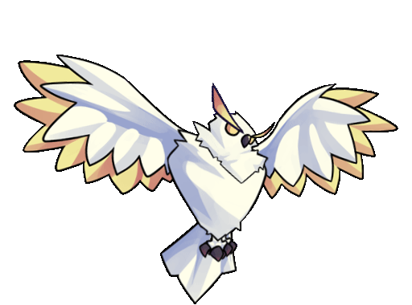
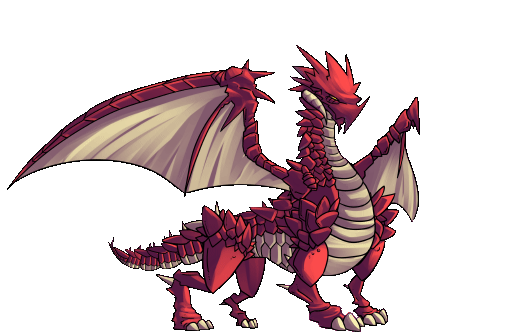
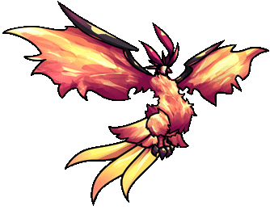

# awesome-fancy-tool

FancyTool GIF resources

The image is from the internet. If it infringes, please contact us for deletion.

  
  
  
  

  
  
  
  

  
  
  
  

  
  
  
  

  
  
  
  

  
  
  
  

  
  
  
  

  
  
  
  

  
  
  
  

  
  
  
  

  
  
  

